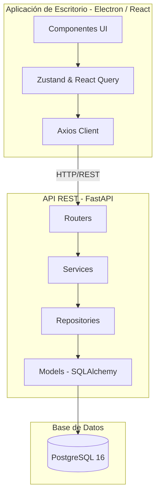
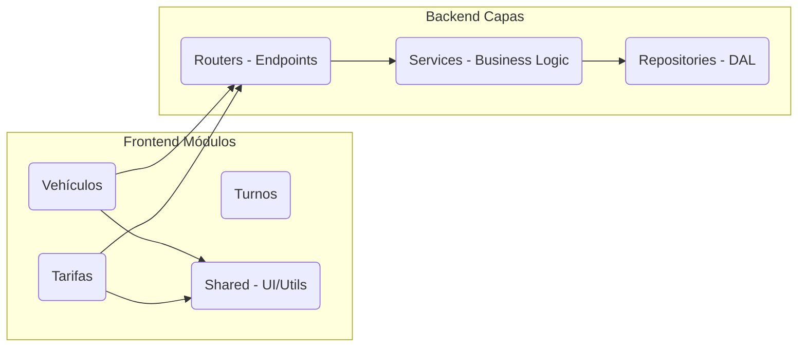
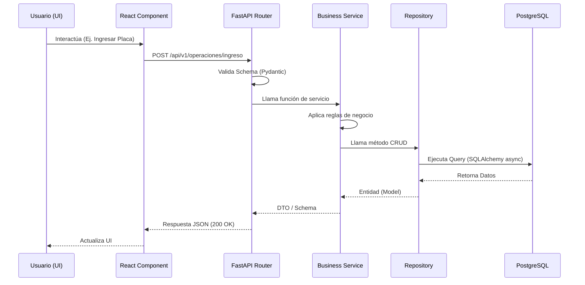

# Arquitectura del Sistema

Este documento detalla la arquitectura de software de SmartPark Pro, orientada a separar responsabilidades, asegurar alta cohesión y facilitar el mantenimiento.

## Arquitectura General

El sistema se compone de tres piezas fundamentales:
1. **Frontend (Aplicación de Escritorio):** Construido con Electron y React. Actúa como el cliente grueso (Rich Client) que interactúa con el usuario y maneja su propio estado asíncrono.
2. **Backend (API REST):** Construido con FastAPI. Expone los endpoints, ejecuta la lógica de negocio, realiza validaciones y se comunica con la base de datos.
3. **Base de Datos:** PostgreSQL para persistencia de datos relacionales, garantizando propiedades transaccionales (ACID).

### Comunicación entre capas
El Frontend se comunica con el Backend a través de peticiones HTTP RESTful usando JSON. El estado del lado del cliente se sincroniza mediante React Query.
El Backend interactúa con la Base de Datos utilizando llamadas asíncronas a través de SQLAlchemy y `asyncpg`.

---

## Diagrama de Arquitectura

---

## Diagrama de Componentes

La distribución del código sigue un modelo modular y por capas.

---

## Flujo de Solicitudes (Request Flow)

---

## Responsabilidad de cada módulo (Frontend)

- **`vehiculos`**: Gestión de placas, tipos de autos. (Pendiente de implementar).
- **`tarifas`**: Reglas de cobro. (Pendiente de implementar).
- **`espacios`**: Disponibilidad del parqueadero. (Pendiente de implementar).
- **`caja` & `turnos`**: Gestión del dinero e inicios de sesión del operador. (Pendiente de implementar).
- **`reportes`**: Dashboard estadístico y exportación de datos. (Cascarón implementado).
- **`shared`**: Componentes visuales genéricos (botones, inputs) y hooks comunes. (Cascarón implementado).

### Dependencias y Patrones (Frontend)
- Los módulos deben ser independientes y no importarse entre sí.
- `pages/` actúa como el ensamblador (Composition Root) que une diferentes componentes de módulos.

## Responsabilidad de cada capa (Backend)

- **`routers/`**: Puntos de entrada HTTP. Su única responsabilidad es recibir el JSON, validarlo (Pydantic) e invocar al servicio.
- **`services/`**: Lógica central. Aquí residen los cálculos de tarifas y validaciones de negocio. (Pendiente de implementar).
- **`repositories/`**: Capa de acceso a datos (DAL). Abstrae SQLAlchemy del resto de la aplicación. (Pendiente de implementar).
- **`models/`**: Clases de SQLAlchemy que mapean las tablas de Postgres. (Pendiente de implementar).
- **`schemas/`**: DTOs (Data Transfer Objects) creados con Pydantic. (Pendiente de implementar).

### Reglas de Dependencia (Backend)
`routers` $\rightarrow$ `services` $\rightarrow$ `repositories` $\rightarrow$ `models`.
**Prohibido saltar capas:** Un Router no puede inyectar un Repository directamente.
