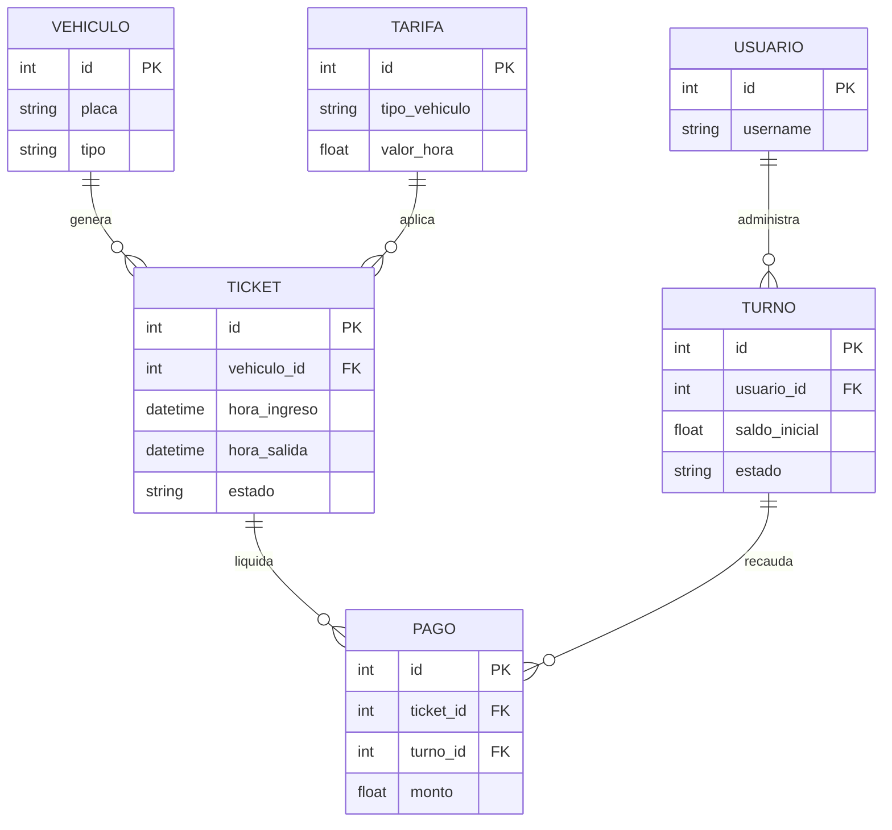

# Base de Datos

*Nota importante: Según la Fase 1 actual del proyecto, el esquema de base de datos descrito a continuación es **Propuesto / Pendiente de Implementación**. En el código fuente actual solo existe la configuración base de SQLAlchemy y Alembic, no los modelos físicos.*

## Modelo de Datos (Propuesto)

### Tabla: VEHICULOS
Almacena el registro histórico o temporal de los autos ingresados.

| Campo | Tipo | Nullable | Descripción |
| ----- | ---- | -------- | ----------- |
| `id` | Integer | No | PK - Identificador único |
| `placa` | Varchar(10) | No | Número de matrícula del vehículo |
| `tipo` | Varchar(50) | No | Moto, Automóvil, Camioneta, etc. |

### Tabla: TICKETS
Corazón de las operaciones. Relaciona el vehículo con su tiempo en el parqueadero.

| Campo | Tipo | Nullable | Descripción |
| ----- | ---- | -------- | ----------- |
| `id` | Integer | No | PK - Identificador único del recibo |
| `vehiculo_id` | Integer | No | FK a VEHICULOS |
| `hora_ingreso` | Timestamp| No | Fecha/hora exacta de entrada |
| `hora_salida` | Timestamp| Sí | Nulo si el vehículo sigue en sitio |
| `estado` | Varchar(20) | No | 'ACTIVO', 'PAGADO', 'ANULADO' |

### Tabla: TURNOS
Control de acceso de los cajeros/operadores.

| Campo | Tipo | Nullable | Descripción |
| ----- | ---- | -------- | ----------- |
| `id` | Integer | No | PK - ID del turno |
| `usuario_id` | Integer | No | FK a USUARIOS |
| `saldo_inicial`| Numeric | No | Base de caja |
| `estado` | Varchar(20) | No | 'ABIERTO', 'CERRADO' |

---

## Diagrama ER (Propuesto)

## Consideraciones Técnicas
- **Migraciones:** Todas las modificaciones a la BD deben realizarse generando scripts de `alembic` (`alembic revision --autogenerate`).
- **Motor Asíncrono:** La BD se opera mediante `asyncpg`, asegurando llamadas no bloqueantes desde FastAPI.
- **Relaciones e Índices:** Se propondrá indexar las columnas `placa` (para búsquedas rápidas) y las llaves foráneas como `vehiculo_id`.
